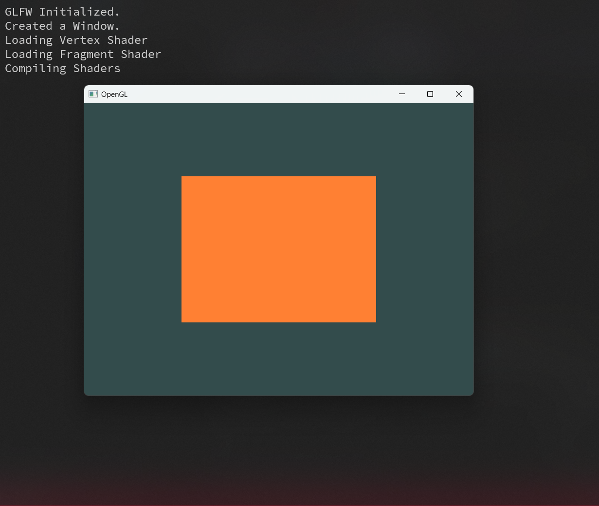
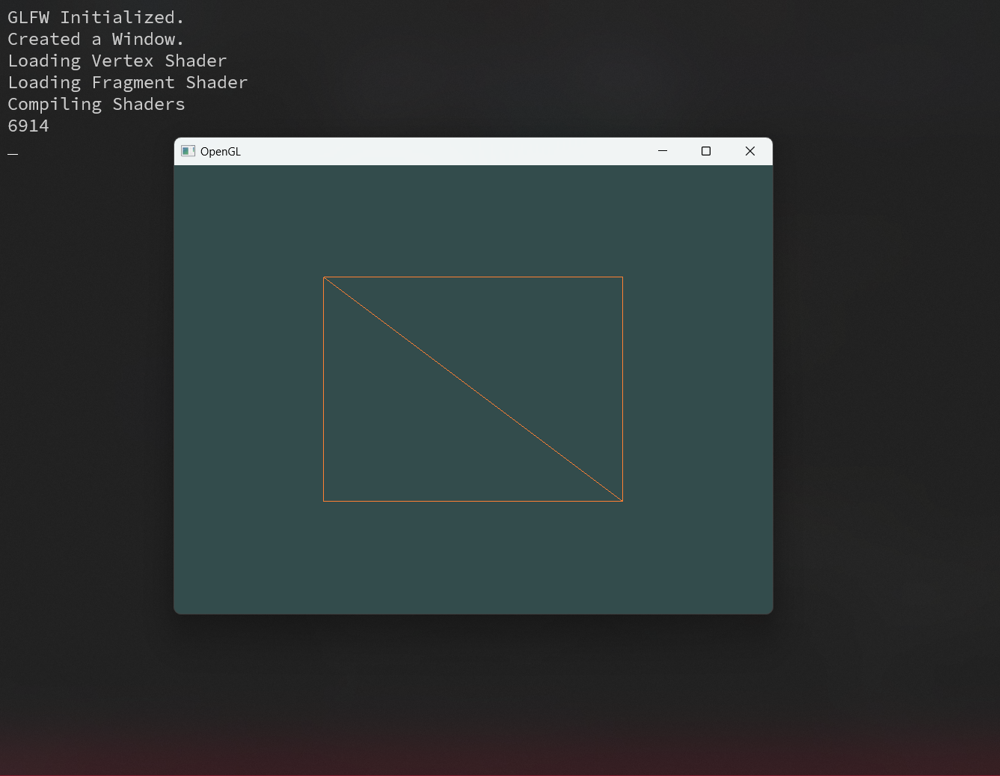
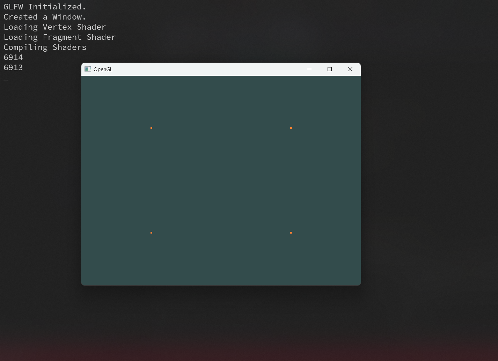

# OpenGL-Execute

This project is an implementation of OpenGL 3.3.
The Libraries I used are :

- **GLFW** : For creating and managing Windows.
- **GLAD** : For loading OpenGL functions at runtime.

Functionality :

- Uses Vertex and Fragment Shaders
- Implemented VAO, VBO for rendering.
- Also EBO for removing duplicate vertices.
- Key Inputs for :
  - **Esc** : For exiting the Application
  - **W** : For switching between Rendering Modes

